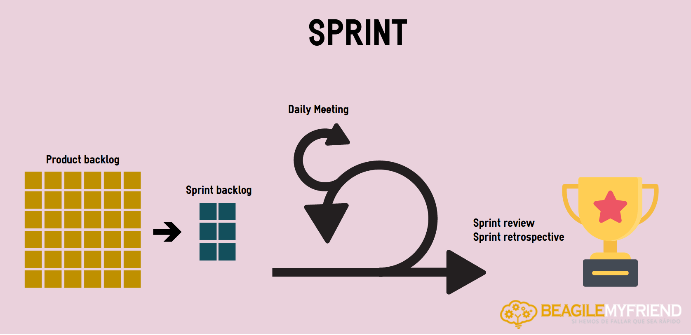
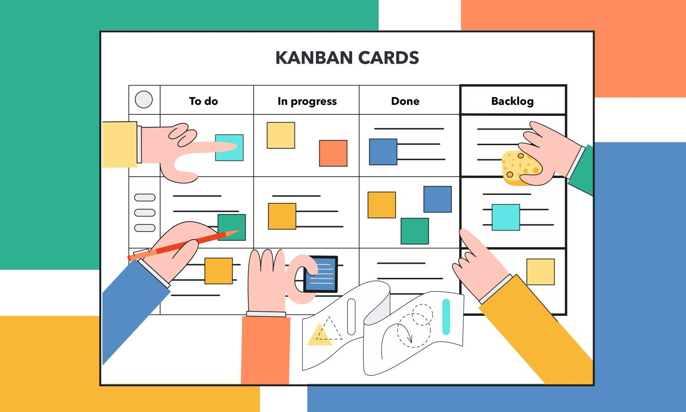

# Metodologías Ágiles 📈🗓📋

Aquellas que permiten flexibilidad y rapidez en respuesta y adaptación del desarrollo de un proyecto al entorno que se presente. La gestión ágil de proyectos proporciona ventajas principalmente en reducción de costes, aumento de productividad, calidad de producto y trabajo colaborativo.

## Scrum 🏆

Esta metodología de desarrollo de proyectos basada en el trabajo colaborativo y sus buenas prácticas.\
Scrum consiste en dividir el proyecto en "pequeños proyectos" donde se estarán realizando ciclos temporales y de tiempo fijo, a estos ciclos se les llama $iteraciones$ o $sprint$.\
Se realizan reuniones frecuentes para la planificación de sprints, de revisión para el control de errores y de retrospectiva, siendo esta útlima la más importante pues se realiza al finalizar cada sprint a manera de reflexión y propuesta de mejoras.

* ### Visión del producto 👁‍🗨

    La visión del producto es la idea de que todo miembro del $scrum team$ tenga claro hacia donde se quiere llegar, que todos tengan un objetivo compartirdo. Es de las primeras acciones al iniciar un proyecto donde se describen los objetivos, las necesidades del cliente y las metas de negocio.\
    Se dice que realizar este ejercicio será de mucha ayuda para realizar el primer Product backlog.

* ### Sprint 🏃‍♂️

    Cada Sprint o iteración consiste en entregables y parciales del producto final que puedan ser entregados en cualquier momento que el cliente lo solicite (incremento). Dichos entregables se trabajan entre 2 y máximo 4 semanas. Todo sprint comienza siendo planeado y finaliza con una reunión, la reunión de retrospectiva.

    

* ### Product Backlog

    Se le conoce como pila del producto, no es más que una lista que detalla los requisitos del cliente o del sistema, es todo aquello que esperan los stakeholders del producto y todo aquello que debe incorporarse al producto a través de los sprints, es decir, todo aquello que derive en un trabajo en equipo. Esta lista está en constante cambio conforme se desarrolla el proyecto.

* ### Sprint Backlog

    Es la lista donde se encuentran las tareas que un equipo va a realizar durante una iteración. Es un subconjunto de requsitos proveniente del product backlog, su construcción comienza con una la reunión de planificación del sprint, se selecciona lo que se podrá completar y demostrar al finalizar el sprint convirtiendolo en tareas y para cada una se detalla:
  * Descripción breve de la tarea.
  * Persona asignada.
  * Estado.
  * Esfuerzo pendiente para su finalización.
  
  Por sus propiedades es útil para identificar avance diario, riegsos y problemas en los equipos donde provoca un no avance, para así tomar decisiones.

* ### Historias de usuario 👥

    Son pequeñas y simples descripciones de los requerimentos escritas desde la perspectiva de usuario o cliente. Son lo suficientemente pequeñas para entrar en una iteración y generalmente responden al  siguiente formato:
    $$Como <¿Quién?> Quiero <¿Qué?(Objetivo)> Para < Motivo > $$
    Se suelen redactar en post it o pequeñas fichas, se almacenan o se organizan en paredes/pizarrones para facilitar su lectura y debate.

* ### Épicas 📖

    Las épicas son un conjunto de historias de usuario que juntas conforman la épica, se puede ver como una historia de usuario grande que será dividida en pequeñas historias para su tratamiento en los sprint.

* ### Tareas 📝

    Las tareas resultan al fragmentar las historias de usuario para que los equipos se encarguen de realizarlas idealmente una por cada jornada de trabajo (tareas diarias).

* ### Puntos de historia 📍

    Sirven para estimar el esfuerzo total que un equipo deberá hacer para finalzar correctamente cualquier elemento ya sea general del product backlog o de un sprint backlog. Principalmente se usa para gestionar la incertidumbre.

## Personajes de la metodología Scrum: roles

* ### Product Owner 👨‍💼

    Es el rol representante del cliente y stakeholders dentro del desarrollo del producto, gestiona el valor del producto a través del Product backlog, para ello debe conocer el negocio del cliente, las necesidades y el objetivo que se desea cumpla el sistema, tener muy claro la visión del producto, conocer lo anterior para ser capaz de tomar decisiones contra todo aquello que afecte lo esperado del producto, pues va a tomar las decisiones del cliente.

* ### Scrum Master 🕵️‍♀️

    El responsable de este rol se encarga de procurar la correcta aplicación de Agile y las prácticas de Scrum en la organización. Es un líder que sirve y ayuda tanto al propietario del producto/cliente como al equipo, así como la relación con la organización y stakeholders.
    Tiene como responsabilidades: el moderar las reuniones, eliminar obstaculos que impiden un proyecto ágil, guiar al equipo (asesoramiento y formación), mejorar la productividad y procurar la mejora continua de las prácticas scrum.

* ### Development Team 👨‍💻

    Son las personas que en equipo desarrollan el producto, son los que realizan los incrementros a través de los sprints. Normalmente son equipos de 3 a 9 personas quienes comparten responsabilidades de trabajo.

* ### Scrum team o Agile team

    Es la unión de todos los roles anteriores, engloba al Product Owner, Scrum Master y Development Team.

## Kanban 📅

Se conoce como un tablero que gestiona el flujo de trabajo en referencia a tiempos maximizando la eficiencia, con ello se eliminan tiempos muertos y sobrecarga de trabajo. \
Su traducción es: tarjetas ("Ban") visuales ("Kan"), y como su nombre lo dice, en el tablero se verá de manera muy visual y en tarjetas las tareas, su seguimiento, la priorización, supervisión del equipo, etc.

## ¿Qué es Jira?

Se trata de un Software desarrollado por la empresa __Atlassian__ el cuál está hecho para gestionar el trabajo de equipos ágiles, gestión de proyectos, equipos de desarrollo de software, equipos de DevOps, gestión de productos, gestión de tareas, seguimiento de errores, etc.
Ofrece herramientas para flujo de trabajo, tableros Scrum y Kanban y en general para el trabajo de diferentes equipos de trabajo que estén realizando un proyecto (no solo de software), también ofrece la posibilidad de hacer videoconferencias dentro de la aplicación, vinculación con otras herramientas de software que ya se utilizan y está disponible para dispositivos móviles, desktop y web.

Yo creo que esta herramienta sirve para diferentes formas de trabajo y proyectos, da soluciones para que no se complique la comunicación y el avance en general de un proyecto. Esto beneficia a las empresas que necesitan productos y a los equipos que los desarrollan en la búsqueda de hacer proyectos ideales hablando de comunicación, tiempos, calidad, y resumiendo; de manera eficiente y eficaz. \
Ya había escuchado un poco de esta aplicación, creo que su popularidad se ha disparado exponencialmente debido a los tiempos actuales donde predominó muchos meses el home office, dando a los equipos una solución a esta distancia. \
Después de esta investigación y sin haber empezado a utilizar esta herramienta, veo que reúne todo lo necesario para realizar proyectos desde muy sencillos como pueden ser solo algunas tareas hasta proyectos grandes no solo de software y sin dejar nada fuera, en el caso especial de Scrum, reune en un lugar todo lo que en este reporte plasmo. Ahora tengo ganas de probar la herramienta que incluso visualmente es atractiva.

## Referencias

* Atlassian. (c2021). Atlassian Agile Coach. Retrieved 21 September, 2021, from <https://www.atlassian.com/es/agile>

* Scrum manager. (c2013). Scrum Manager BoK. Retrieved 21 September, 2021, from <https://www.scrummanager.net/bok/index.php?title=Scrum_Manager_BoK>

* Laia Gilibets. (2020, 11 NOVIEMBRE). Qué es la metodología Kanban y cómo utilizarla. [Weblog]. Retrieved 21 September 2021, from <https://www.iebschool.com/blog/metodologia-kanban-agile-scrum/>

* Laia Gilibets. (2020, 11 NOVIEMBRE). Las metodologías ágiles más utilizadas y sus ventajas dentro de la empresa. [Weblog]. Retrieved 21 September 2021, from <https://www.iebschool.com/blog/metodologia-kanban-agile-scrum/>

* Scrum México. (c2021). Conoce y profundiza en los temas más relevantes del mundo ágil. Retrieved 21 September, 2021, from <https://scrum.mx/informate>
